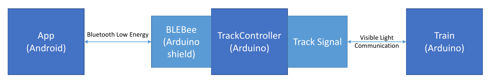

# Introduction

This is the documentation for the [Communication Systems Lab](https://www.comsys.rwth-aachen.de/teaching/ws-1516/lab-communication-systems/) at [COMSYS](https://www.comsys.rwth-aachen.de/home/) from [RWTH Aachen](https://www.rwth-aachen.de/).
The Goal of our group was to implement Visible Light Communication (VLC) and demonstrate the system using a fitting Use Case.
We were inspired by the work of [Disney Research](https://www.disneyresearch.com/project/visible-light-communication/).

We chose to control a Lego Train with a signal that communicates with the Train via VLC.
Both, the Train and the Controller use an Arduino Mega and a self-made shield which enables VLC and Motor control. An Android App was created to communicate with the Track Controller via Bluetooth Low Energy (BLE) using the [BLEBee Shield](http://www.mkroll.mobi/?page_id=1070).
The figure below shows this architecture.

[This Video](https://www.youtube.com/watch?v=fITTPJj3OIQ) gives a demonstration of the working system. It shows the Train receiving several commands from the Android App like changing its speed, direction or switching the front/rear lighting.

If you are interested in more details, have a look are our [final presenation](slides/Final_Presentation.pdf). It includes details regarding the implemented protocol, an evaluation of transmission speeds and distances and many pictures.

# Arduino Shield

If you are interested in building the Arduino shield yourself, you can find the Eagle files [here](eagle/) (will be added in the next few days). See below for pictures of the schematic and the board.

# Track and Train Controller

The Source Code of both our Track and Train Controller are in [this repository](https://github.com/COMSYS-VLC/arduino-vlc).

It uses [Arduino CMake](https://github.com/queezythegreat/arduino-cmake) and expects the serial ports of the Arduinos at `/dev/ttyController` and `/dev/ttyTrain`. Edit [CMakeLists.txt](https://github.com/COMSYS-VLC/arduino-vlc/blob/master/CMakeLists.txt#L22) to use different devices.

# TrainControl Android App

The Source Code of our Android App is in [this repository](https://github.com/COMSYS-VLC/TrainControl).
Use [Android Studio](http://developer.android.com/sdk/index.html) to open and build the App.

# Support

Our Group consists of Oliver Ney, Michael Deutschen and Jan Bruckner.

Feel free to contact us via GitHub if you have any questions, need further information or are interested in building this project yourself. We also appreciate feedback on our work in the form of comments or pull requests.
